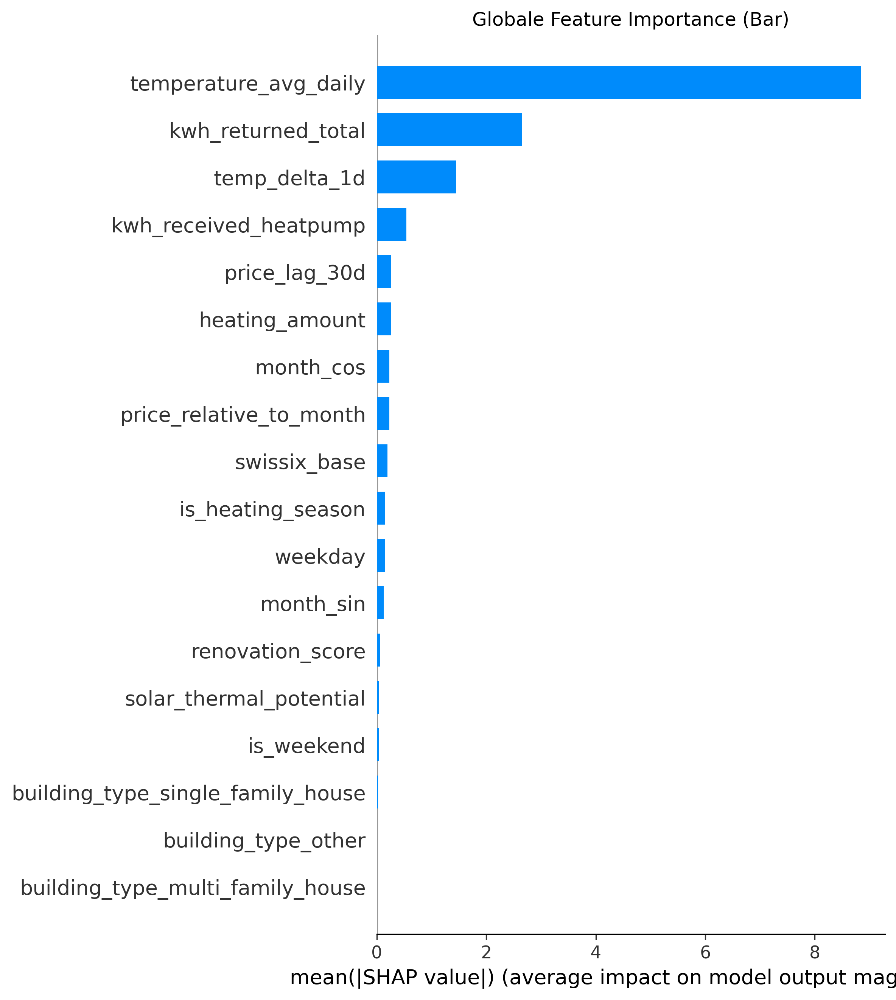
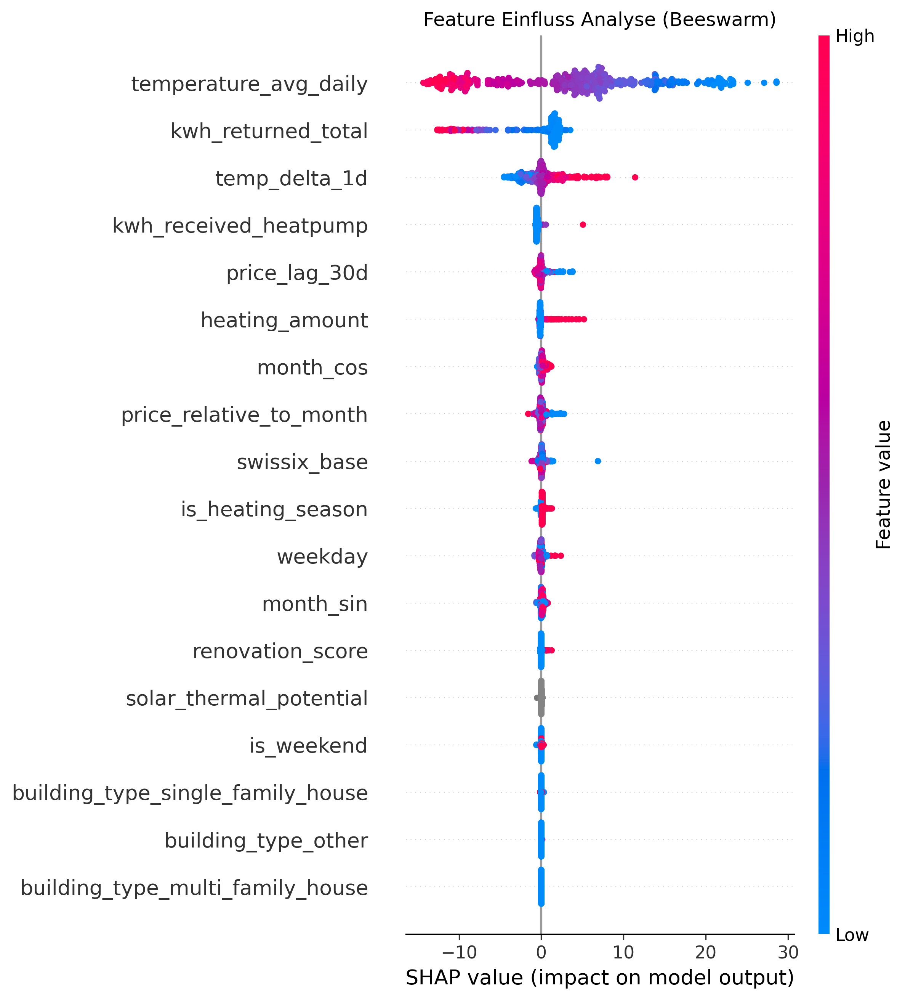

# 📚 Feature Engineering

Diese Dokumentation beschreibt die Vorgehensweise beim Feature Engineering 

## 📋 Feature Erstellung

In der Pipeline werden mehrere Features für die Vorhersage des Energieverbrauchs generiert. Die Beschreibung der einzelnen Features folgt der Reihenfolge im features.py-File.

Wochentage
Auf Basis des Datums werden numerische Werte generiert, die die Wochentage abbilden. So erhält beispielsweise der Sonntag den Wert 7, der Samstag den Wert 6 usw.

Wochenende
Die Wochentage dienen als Grundlage, um einen Wochenend-Indikator zu erzeugen. Tage, die auf ein Wochenende fallen, erhalten den Wert 1, während Werktage den Wert 0 erhalten.

Heizperiode
Die Heizperiode in Mitteleuropa dauert typischerweise von Oktober bis März. Entsprechend wird ein Dummy-Feature erstellt, das in diesen Monaten den Wert 1 und in den übrigen Monaten den Wert 0 annimmt.

Renovation Index
Der Renovationsindex summiert mehrere Dummy-Variablen, die angeben, ob Renovierungen an bestimmten Gebäudeteilen (z. B. Fenster, Dach oder Wände) durchgeführt wurden.

Heizbedarf
Der Heizbedarf wird aus der beheizten Fläche und der Anzahl der Bewohner eines Gebäudes berechnet.

Preisfeatures
Auf Basis der Day-Ahead-Strompreise werden Lag-Features sowie gleitende Durchschnittswerte für 30 und 90 Tage berechnet. Zusätzlich werden Abweichungen des aktuellen Tagespreises von diesen Durchschnittswerten bestimmt.

Solarpotenzial
Das Potenzial zur Solarstromerzeugung wird durch die Multiplikation der PV-Anlagengröße mit der täglichen Sonnenscheindauer approximiert.

Thermische Dynamik
Um die thermische Trägheit von Gebäuden sowie kurzfristige Temperaturveränderungen abzubilden, werden zwei zusätzliche Temperaturfeatures berechnet:
temp_inertia_ema_3d: ein exponentiell gewichteter gleitender Durchschnitt der Temperatur über drei Tage, der das thermische Gedächtnis eines Gebäudes approximiert.
temp_delta_1d: die tägliche Veränderung der Durchschnittstemperatur im Vergleich zum Vortag.

Zyklische Features
Um saisonale Effekte besser abzubilden, werden zyklische Transformationen (Sinus und Cosinus) für Monatswerte berechnet.

Gebäudetypen
Für die Gebäudetypen werden Dummy-Variablen (One-Hot-Encoding) erstellt. Die Kategorie „Unbekannt“ dient dabei als Referenzkategorie und wird nicht explizit als Feature kodiert.

Weitere verwendete Variablen

Zusätzlich zu den erzeugten Features werden weitere Variablen direkt aus dem Datensatz verwendet. Dazu zählen:
kwh_received_heatpump – Stromverbrauch der Wärmepumpe
kwh_returned_total – Gesamtmenge des eingespeisten Stroms
temperature_avg_daily – durchschnittliche Tagestemperatur
swissix_base – Day-Ahead-Strompreis

## 🛠 Feature Selektion, Importance und Validierung

1. Korrelationen der Features 

 **temp_inertia_ema_3d** weist eine hohe Korrelation mit anderen Variablen auf und kann somit als redundant betrachtet werden kann. Auf Grundlage dieser Analyse wurde das Feature aus dem Datensatz entfernt.

Die Identifikation stark korrelierter Features erfolgt mithilfe der  **def correlated_features_drop**, die eine Korrelationsmatrix des Trainingsdatensatzes berechnet und Variablen entfernt, deren Korrelation einen Schwellenwert von **0.90** überschreitet.

2. Importance und Validierung der Features

Um den Einfluss der Features zu analyiseren wird ein Random Forst mOdell als Basis verwendet, sodass die benötigen plots erzeugt werdne könnne. 
So sieht man anhand des Importnace Plots recht deutlich, die wichgsten Features: 1. temperature_avg_daily, 2. kwh_returned_total, 3. temp_delta_1d

Alle weiteren Features haben nur einen geringen Einfluss auf den Stromvebrauch.

Der Beeswarm-Plot ergänzt die globale Wichtigkeit um die Richtung und Stärke der Effekte. Beim Feature temperature_avg_daily zeigt sich ein deutliches Muster: Niedrige Temperaturen (blaue Punkte) führen zu stark positiven SHAP-Werten – die Kälte erhöht den Verbrauch erwartungsgemäß massiv.

Für den heating_amount wird ersichtlich, dass der Gesamtverbrauch bei hohen Werten (rote Punkte) tendenziell steigt. Da die meisten Punkte jedoch auf der vertikalen Null-Linie liegen, hat das Feature für den Großteil der Daten keinen Einfluss auf die Vorhersage. Dies ist auf die identifizierten der Missing-Werte zurückzuführen, wodurch das Feature in seiner aktuellen Form für das Modell kaum Informationsgehalt bietet.

Features die einen kleinen aber erwartebaren Effekt haben sind folgede:
kwh_received_heatpump – kleiner aber plausibler Effekt, behalten
price_lag_30d & price_relative_to_month – Preissignale mit minimalem Effekt, können bleiben wenn inhaltlich relevant
month_sin & month_cos – zyklische Monatskodierung, sinnvoll aber schwacher Effekt
is_heating_season – stark mit Temperatur korreliert, möglicherweise redundant

Auf Basis der Importance Analyse werden folgende Feature entfernt: 
heating_amount: Featee nicht sinnvoll intepretierbat
Dummys für Haustypen: SHAP = 0 -> Kein Beitrag
solar_thermal_potential: Keine Varianz im Beeswarm, grau = kein Effekt
is_weekend: Minimaler Effekt, kaum relevant
renovation_score: Fast kein Einfluss
is_heating_seaso: Redundant zu temperature_avg_daily

Die F