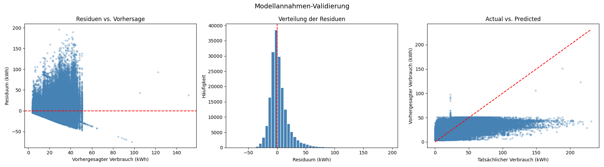

📊 Modellannahmen-Validierung

Plot 1 – Residuen vs. Vorhersage
Deutliches Trichtermuster (Heteroskedastizität) – bei niedrigen Vorhersagen (~0–25 kWh) streuen die Residuen stark, bei höheren Werten wird die Streuung geringer. Das bedeutet: das Modell ist bei niedrigem Verbrauch ungenauer als bei hohem. Typisch für Energiedaten mit vielen Null-nahen Werten.
Plot 2 – Residuen-Verteilung
Stark rechtsschiefe Verteilung mit einem langen rechten Ausläufer bis 190 kWh. Der Peak liegt nahe 0, aber die Ausreißer nach oben sind erheblich. Mean Residuum von -1.85 kWh ist akzeptabel (nah an 0), aber die Std von 16.97 kWh zeigt hohe Streuung.
Plot 3 – Actual vs. Predicted
Das Modell unterschätzt hohe Verbräuche systematisch – bei tatsächlichen Werten über 75 kWh liegen die Vorhersagen deutlich unter der roten Linie. Bei niedrigen Werten (0–50 kWh) ist die Vorhersage dichter, aber mit viel Streuung.

📝 Trainingsbericht
Modell: LightGBM Regressor, optimiert via Optuna (50 Trials, TimeSeriesSplit 5 Folds)
Finale Modellparameter:

Learning Rate: 0.051, Estimators: 254, Num Leaves: 110, Max Depth: 11

Leistungsmetriken (Testset)
Metrik
MAE 12.02 kWh 
R²0.338
Mean Residuum-1.85 kWh
Std Residuum 16.97 kWh

Kreuzvalidierung (3 Folds)
FoldM
AER²116.50 kWh ⚠️0.155211.61 kWh ✅0.222310.86 kWh ✅0.420Ø12.99 kWh0.266

Interpretation der Modellannahmen
Das Modell zeigt Heteroskedastizität – die Vorhersagegenauigkeit nimmt bei hohem Verbrauch ab. Dies ist auf die rechtsschiefe Verbrauchsverteilung zurückzuführen und ein bekanntes Verhalten bei Energieverbrauchsdaten. Eine Log-Transformation der Zielvariable könnte dieses Verhalten reduzieren, wurde jedoch zugunsten der Interpretierbarkeit nicht angewendet. Systematische Unterschätzung bei Extremverbrauch (>75 kWh) deutet auf fehlende erklärende Variablen hin, die Spitzenverbräuche treiben – vermutlich haushaltsspezifische Faktoren wie Bewohnerzahl oder Geräteausstattung.
Fazit
Das Modell ist für den mittleren Verbrauchsbereich (0–75 kWh) gut geeignet. Für Haushalte mit Extremverbrauch sind die Vorhersagen mit Vorsicht zu interpretieren.